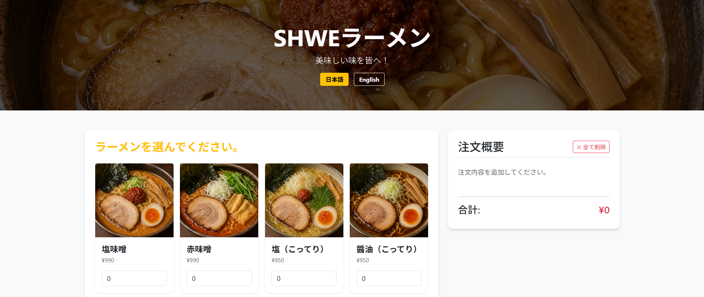

# 🍜 SHWE Ramen Order System
## Live Demo
https://w25009.github.io/shwe-ramen-order-system/

ラーメン店向けに設計された、レスポンシブ対応かつ2言語（日本語・英語）切り替え可能なデジタルメニューおよび注文システムです。
お客様が手元の端末（スマホやタブレット）から、ラーメンの選択、トッピングのカスタマイズ、お得なセットやドリンクの追加を行い、リアルタイムに合計金額を確認しながらスムーズに注文できる環境を提供します。

---

## 📸 実際の画面（スクリーンショット）

ホームページ

---

## ✨ 主な機能

* **2言語サポート（バイリンガル対応）**
  * ボタンひとつで日本語（日本語）と英語（English）をスムーズに切り替え可能。
  * メニュー名だけでなく、入力欄のプレースホルダー（例：「田中」→「John」）まで連動して切り替わります。
* **リアルタイムな注文概要（動的カート）**
  * 数量を変更すると、サイドバーの注文概要と合計金額がリアルタイムに再計算されて即座に反映されます。
* **柔軟なアイテム管理（個別削除機能）**
  * 注文概要（カート）の一覧から、各アイテムの「❌」ボタンを押すことで、特定のラーメンやトッピング、セットメニュー、ライス、ドリンクを個別に削除・調整できます。
* **充実したメニューセクション**
  * **ラーメン選択:** 味噌、赤味噌、塩・醤油（こってり/あっさり）、ジャンラーメン、つけラーメン、野菜ラーメン、餃子、チャーハン、チャーシュー丼
  * **オプショントッピング:** 味玉、チャーシュー、メンマ、もやし、ねぎ、ノリ、コーン、梅干し
  * **セット＆ライス:** お得なコンビネーションセット（複数選択可）、ライス（普通・小）
  * **お飲み物:** ビール、ハイボール、ウーロン茶、コーラ
* **バックエンド連携（注文送信）**
  * お客様の名前とテーブル番号の入力バリデーションを通過後、注文内容と合計金額を含む構造化されたJSONペイロードをローカルのAPIサーバーへ送信します。

---

## 🛠️ 使用した技術

* **フロントエンド:**
  * HTML5 / CSS3（独自カスタムスタイル）
  * JavaScript (ES6+)：DOM操作、リアルタイム計算、言語切り替え、Fetch APIによる非同期通信
  * Bootstrap 5：モバイルファーストのレスポンシブUI、カードデザイン、グリッドレイアウトの構築
* **バックエンド (想定環境):**
  * Node.js / Express（ポート `8080` で動作するローカルサーバー）

---

## 🚀 導入手順（インストール・実行方法）

### 1. 前提条件
注文送信機能を完全にテストするには、ローカルで `http://localhost:8080/api/order` に対応したバックエンドサーバーが起動している必要があります。
*(※サーバーが起動していない場合でも、フロントエンドのバリデーションや合計金額の計算機能はそのまま動かすことができます)*

